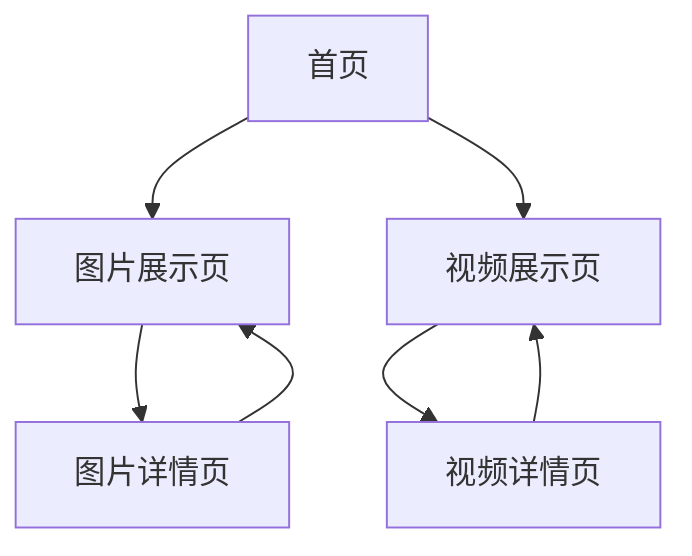

# 本地素材展示平台产品需求文档

## 1. Product Overview
本地素材展示平台是一个采用苹果设计风格的网页应用，专门用于展示和管理本地存储的视频和图片素材。
- 解决用户需要优雅展示本地媒体文件的需求，提供类似苹果官网的简洁现代体验。
- 目标用户为需要展示作品集、素材库或媒体文件的创作者、设计师和内容制作者。

## 2. Core Features

### 2.1 Feature Module
我们的本地素材展示平台包含以下主要页面：
1. **首页**：导航栏、英雄区域、素材分类入口
2. **图片展示页**：图片网格展示、预览功能、筛选排序
3. **视频展示页**：视频缩略图展示、播放预览、筛选排序
4. **素材详情页**：单个素材的详细信息和全屏预览

### 2.2 Page Details

| Page Name | Module Name | Feature description |
|-----------|-------------|---------------------|
| 首页 | 导航栏 | 顶部固定导航，包含Logo、主要功能入口、搜索框 |
| 首页 | 英雄区域 | 大尺寸背景展示区域，突出平台特色和核心价值 |
| 首页 | 分类入口 | 图片和视频两个主要分类的快速入口卡片 |
| 图片展示页 | 图片网格 | 响应式网格布局展示图片缩略图，支持懒加载 |
| 图片展示页 | 预览功能 | 点击图片弹出大图预览，支持左右切换浏览 |
| 图片展示页 | 筛选排序 | 按文件类型、大小、修改时间等条件筛选和排序 |
| 视频展示页 | 视频网格 | 响应式网格布局展示视频缩略图和基本信息 |
| 视频展示页 | 播放预览 | 悬停显示播放按钮，点击弹出视频播放器 |
| 视频展示页 | 筛选排序 | 按视频格式、时长、大小等条件筛选和排序 |
| 素材详情页 | 详细信息 | 显示文件名、大小、格式、修改时间等元数据 |
| 素材详情页 | 全屏预览 | 图片全屏查看，视频全屏播放，支持键盘操作 |

## 3. Core Process

**主要用户操作流程：**
1. 用户访问首页，浏览平台介绍和功能入口
2. 选择图片或视频分类进入对应展示页面
3. 在展示页面浏览素材缩略图，使用筛选和排序功能
4. 点击感兴趣的素材进入详情页查看完整信息
5. 在详情页进行全屏预览或播放操作

## 4. User Interface Design

### 4.1 Design Style
- **主色调**：白色 (#FFFFFF) 和浅灰色 (#F5F5F7)
- **辅助色**：苹果蓝 (#007AFF) 和深灰色 (#1D1D1F)
- **按钮样式**：圆角矩形，轻微阴影，悬停时颜色变化
- **字体**：SF Pro Display (苹果系统字体) 或 Helvetica Neue
- **布局风格**：大量留白，卡片式设计，顶部导航栏
- **图标风格**：线性图标，简洁现代，与苹果设计语言一致

### 4.2 Page Design Overview

| Page Name | Module Name | UI Elements |
|-----------|-------------|-------------|
| 首页 | 导航栏 | 白色背景，居中Logo，右侧搜索框，固定顶部，轻微阴影 |
| 首页 | 英雄区域 | 全宽背景图，居中大标题，副标题，CTA按钮，渐变遮罩 |
| 首页 | 分类入口 | 两个大尺寸卡片，圆角设计，悬停效果，图标+文字 |
| 图片展示页 | 图片网格 | 响应式网格，圆角缩略图，悬停放大效果，加载动画 |
| 图片展示页 | 筛选排序 | 顶部工具栏，下拉选择器，标签式筛选，清除按钮 |
| 视频展示页 | 视频网格 | 16:9比例缩略图，播放按钮覆盖，时长显示，标题文字 |
| 素材详情页 | 全屏预览 | 黑色背景，居中展示，关闭按钮，导航箭头，信息面板 |

### 4.3 Responsiveness
采用移动优先的响应式设计，支持桌面端、平板和手机端访问，针对触摸操作进行优化。