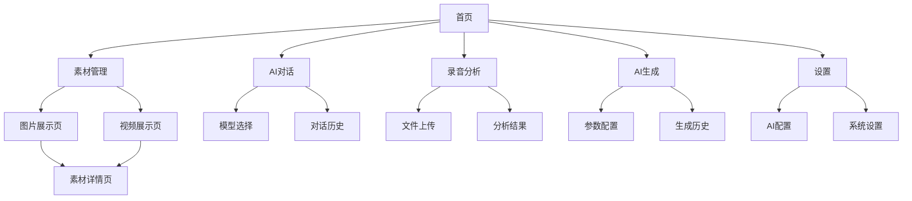

# AI中台产品需求文档

## 1. Product Overview
AI中台是一个采用苹果设计风格的智能化平台，集成了本地素材管理和AI功能服务。
- 解决用户在内容创作、素材管理和AI应用方面的综合需求，提供类似苹果生态的一体化体验。
- 目标用户为创作者、设计师、内容制作者以及需要AI辅助工作的专业人士。
- 打造集素材管理、AI对话、内容生成于一体的智能创作平台。

## 2. Core Features

### 2.1 Feature Module
我们的AI中台平台包含以下主要页面：
1. **首页**：导航栏、英雄区域、功能模块入口
2. **图片展示页**：图片网格展示、预览功能、筛选排序
3. **视频展示页**：视频缩略图展示、播放预览、筛选排序
4. **素材详情页**：单个素材的详细信息和全屏预览
5. **AI对话页**：多模型对话界面、历史记录、模型切换
6. **录音分析页**：录音文件上传、分析结果展示、导出功能
7. **AI生成页**：图片/视频生成界面、参数配置、结果预览
8. **设置页面**：AI模型配置、系统设置、用户偏好

### 2.2 Page Details

| Page Name | Module Name | Feature description |
|-----------|-------------|---------------------|
| 首页 | 导航栏 | 顶部固定导航，包含Logo、主要功能入口、搜索框 |
| 首页 | 英雄区域 | 大尺寸背景展示区域，突出平台特色和核心价值 |
| 首页 | 功能入口 | 素材管理、AI对话、录音分析、AI生成四个主要功能的快速入口卡片 |
| 图片展示页 | 图片网格 | 响应式网格布局展示图片缩略图，支持懒加载 |
| 图片展示页 | 预览功能 | 点击图片弹出大图预览，支持左右切换浏览 |
| 图片展示页 | 筛选排序 | 按文件类型、大小、修改时间等条件筛选和排序 |
| 视频展示页 | 视频网格 | 响应式网格布局展示视频缩略图和基本信息 |
| 视频展示页 | 播放预览 | 悬停显示播放按钮，点击弹出视频播放器 |
| 视频展示页 | 筛选排序 | 按视频格式、时长、大小等条件筛选和排序 |
| 素材详情页 | 详细信息 | 显示文件名、大小、格式、修改时间等元数据 |
| 素材详情页 | 全屏预览 | 图片全屏查看，视频全屏播放，支持键盘操作 |
| AI对话页 | 对话界面 | 类似iMessage的对话界面，支持文本输入、语音输入、图片上传 |
| AI对话页 | 模型切换 | 顶部模型选择器，支持GPT、Claude、Gemini等多种AI模型 |
| AI对话页 | 历史记录 | 左侧边栏显示对话历史，支持搜索、分类、删除操作 |
| 录音分析页 | 文件上传 | 拖拽上传录音文件，支持多种音频格式，显示上传进度 |
| 录音分析页 | 分析结果 | 显示语音转文字、情感分析、关键词提取等分析结果 |
| 录音分析页 | 导出功能 | 支持导出分析结果为PDF、Word、TXT等格式 |
| AI生成页 | 生成界面 | 类似Midjourney的提示词输入框，参数调节面板 |
| AI生成页 | 结果展示 | 网格布局展示生成的图片/视频，支持预览、下载、重新生成 |
| AI生成页 | 历史记录 | 保存生成历史，支持收藏、分类管理 |
| 设置页面 | AI配置 | API密钥管理、模型参数设置、使用量统计 |
| 设置页面 | 系统设置 | 主题切换、语言设置、存储路径配置 |

## 3. Core Process

**素材管理流程：**
1. 用户访问首页，浏览平台介绍和功能入口
2. 选择素材管理进入图片或视频展示页面
3. 在展示页面浏览素材缩略图，使用筛选和排序功能
4. 点击感兴趣的素材进入详情页查看完整信息

**AI对话流程：**
1. 用户进入AI对话页面，选择所需的AI模型
2. 在对话界面输入问题或上传图片进行多模态对话
3. AI返回回答，用户可继续对话或切换模型
4. 对话历史自动保存，支持后续查看和管理

**录音分析流程：**
1. 用户进入录音分析页面，上传音频文件
2. 系统自动进行语音识别和智能分析
3. 展示分析结果包括文字转录、情感分析等
4. 用户可导出分析结果或进行进一步编辑

**AI生成流程：**
1. 用户进入AI生成页面，输入创作提示词
2. 调整生成参数如风格、尺寸、质量等
3. 提交生成请求，等待AI创作完成
4. 预览生成结果，可下载、重新生成或收藏

## 4. User Interface Design

### 4.1 Design Style
- **主色调**：白色 (#FFFFFF) 和浅灰色 (#F5F5F7)
- **辅助色**：苹果蓝 (#007AFF) 和深灰色 (#1D1D1F)
- **按钮样式**：圆角矩形，轻微阴影，悬停时颜色变化
- **字体**：SF Pro Display (苹果系统字体) 或 Helvetica Neue
- **布局风格**：大量留白，卡片式设计，顶部导航栏
- **图标风格**：线性图标，简洁现代，与苹果设计语言一致

### 4.2 Page Design Overview

| Page Name | Module Name | UI Elements |
|-----------|-------------|-------------|
| 首页 | 导航栏 | 白色背景，居中Logo，右侧搜索框，固定顶部，轻微阴影 |
| 首页 | 英雄区域 | 全宽背景图，居中大标题，副标题，CTA按钮，渐变遮罩 |
| 首页 | 功能入口 | 四个大尺寸卡片，圆角设计，悬停效果，SF Symbols图标+文字 |
| 图片展示页 | 图片网格 | 响应式网格，圆角缩略图，悬停放大效果，加载动画 |
| 图片展示页 | 筛选排序 | 顶部工具栏，下拉选择器，标签式筛选，清除按钮 |
| 视频展示页 | 视频网格 | 16:9比例缩略图，播放按钮覆盖，时长显示，标题文字 |
| 素材详情页 | 全屏预览 | 黑色背景，居中展示，关闭按钮，导航箭头，信息面板 |
| AI对话页 | 对话界面 | 类似iMessage的气泡设计，用户消息蓝色，AI回复灰色，圆角气泡 |
| AI对话页 | 输入区域 | 底部固定输入框，圆角边框，发送按钮，语音/图片上传按钮 |
| AI对话页 | 侧边栏 | 左侧历史记录，列表样式，搜索框，分组标签，删除按钮 |
| AI对话页 | 模型选择 | 顶部下拉选择器，模型图标，状态指示器，切换动画 |
| 录音分析页 | 上传区域 | 虚线边框拖拽区域，云朵上传图标，进度条，文件列表 |
| 录音分析页 | 分析结果 | 卡片式布局，文字转录区域，分析图表，标签云，导出按钮 |
| AI生成页 | 输入界面 | 大尺寸文本框，提示词建议，参数滑块，预设模板选择 |
| AI生成页 | 结果展示 | 瀑布流布局，图片卡片，悬停操作按钮，加载骨架屏 |
| AI生成页 | 参数面板 | 右侧固定面板，分组参数，滑块控件，实时预览 |
| 设置页面 | 配置界面 | 分组设置项，开关控件，输入框，保存状态提示 |

### 4.3 Responsiveness
采用移动优先的响应式设计，支持桌面端、平板和手机端访问，针对触摸操作进行优化。