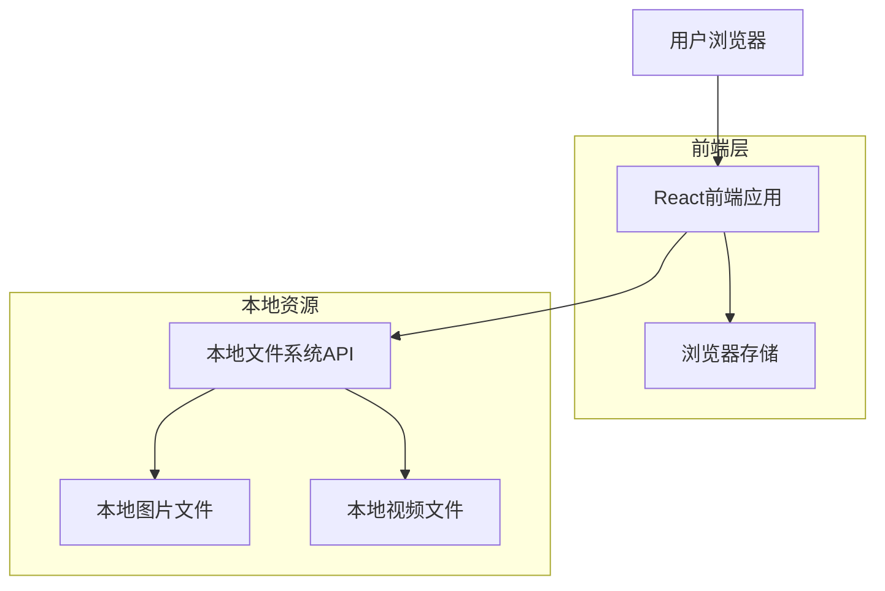

# 本地素材展示平台技术架构文档

## 1. Architecture design



## 2. Technology Description

* Frontend: React\@18 + TypeScript + Tailwind CSS\@3 + Vite

* 本地文件访问: File System Access API (现代浏览器) + 文件拖拽上传

* 状态管理: React Context + useState/useReducer

* 路由: React Router\@6

* 图标: Lucide React (苹果风格图标库)

## 3. Route definitions

| Route      | Purpose              |
| ---------- | -------------------- |
| /          | 首页，展示平台介绍和功能入口       |
| /images    | 图片展示页，网格展示所有图片素材     |
| /videos    | 视频展示页，网格展示所有视频素材     |
| /image/:id | 图片详情页，单张图片的详细信息和全屏预览 |
| /video/:id | 视频详情页，单个视频的详细信息和全屏播放 |

## 4. API definitions

### 4.1 本地文件系统接口

由于是展示本地素材，主要通过浏览器的File System Access API和拖拽上传来访问文件：

**文件选择接口**

```typescript
interface FilePickerOptions {
  types: {
    description: string;
    accept: Record<string, string[]>;
  }[];
  multiple: boolean;
}

// 选择图片文件
const imagePickerOptions: FilePickerOptions = {
  types: [{
    description: 'Images',
    accept: {
      'image/*': ['.png', '.jpg', '.jpeg', '.gif', '.webp']
    }
  }],
  multiple: true
};

// 选择视频文件
const videoPickerOptions: FilePickerOptions = {
  types: [{
    description: 'Videos',
    accept: {
      'video/*': ['.mp4', '.webm', '.ogg', '.mov']
    }
  }],
  multiple: true
};
```

**文件信息类型定义**

```typescript
interface MediaFile {
  id: string;
  name: string;
  type: 'image' | 'video';
  size: number;
  lastModified: number;
  file: File;
  thumbnail?: string;
  duration?: number; // 仅视频文件
  dimensions?: { width: number; height: number };
}

interface MediaLibrary {
  images: MediaFile[];
  videos: MediaFile[];
  totalSize: number;
  lastUpdated: number;
}
```

## 5. 数据存储方案

### 5.1 本地存储策略

由于是纯前端应用展示本地文件，采用以下存储方案：

* **文件引用存储**: 使用浏览器的IndexedDB存储文件引用和元数据

* **缩略图缓存**: 生成的缩略图存储在IndexedDB中以提高加载速度

* **用户偏好设置**: 使用localStorage存储用户的排序、筛选偏好

### 5.2 数据结构设计

```typescript
// IndexedDB 存储结构
interface StoredMediaFile {
  id: string;
  name: string;
  type: 'image' | 'video';
  size: number;
  lastModified: number;
  thumbnail: Blob; // 缩略图数据
  metadata: {
    dimensions?: { width: number; height: number };
    duration?: number;
    format: string;
  };
  tags: string[];
  addedAt: number;
}

// localStorage 用户偏好
interface UserPreferences {
  sortBy: 'name' | 'size' | 'date';
  sortOrder: 'asc' | 'desc';
  viewMode: 'grid' | 'list';
  gridSize: 'small' | 'medium' | 'large';
  filters: {
    fileTypes: string[];
    sizeRange: [number, number];
    dateRange: [number, number];
  };
}
```

## 6. 核心功能实现方案

### 6.1 文件访问和管理

* 使用File System Access API (支持Chrome 86+) 或文件拖拽作为备选方案

* 实现文件类型检测和验证

* 生成图片和视频缩略图

* 提取文件元数据（尺寸、时长等）

### 6.2 性能优化

* 虚拟滚动处理大量文件展示

* 图片懒加载和渐进式加载

* 缩略图缓存机制

* Web Workers处理文件元数据提取

### 6.3 用户体验

* 拖拽上传文件支持

* 键盘快捷键导航

* 全屏预览模式

* 响应式设计适配各种设备

