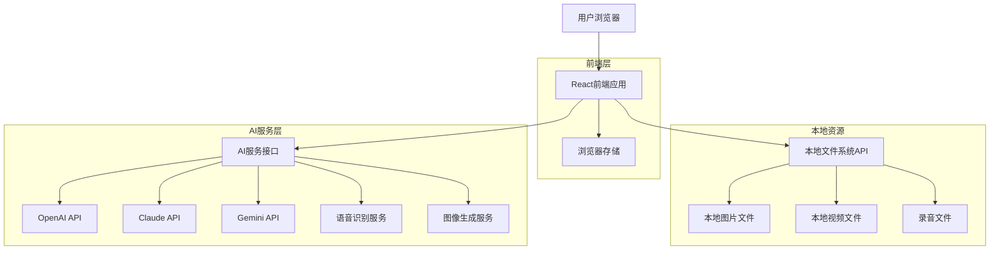

# AI中台技术架构文档

## 1. Architecture design



## 2. Technology Description

* Frontend: React\@18 + TypeScript + Tailwind CSS\@3 + Vite

* 本地文件访问: File System Access API (现代浏览器) + 文件拖拽上传

* 状态管理: Zustand (轻量级状态管理)

* 路由: React Router\@6

* 图标: Lucide React + SF Symbols (苹果风格图标库)

* AI集成: OpenAI SDK + Anthropic SDK + Google AI SDK

* 音频处理: Web Audio API + MediaRecorder API

* 文件处理: File API + Blob API + Canvas API

* UI组件: Headless UI + Framer Motion (动画)

* 数据存储: IndexedDB + localStorage

## 3. Route definitions

| Route      | Purpose              |
| ---------- | -------------------- |
| /          | 首页，展示平台介绍和功能入口       |
| /images    | 图片展示页，网格展示所有图片素材     |
| /videos    | 视频展示页，网格展示所有视频素材     |
| /image/:id | 图片详情页，单张图片的详细信息和全屏预览 |
| /video/:id | 视频详情页，单个视频的详细信息和全屏播放 |
| /ai/chat   | AI对话页，多模型对话界面和历史记录 |
| /ai/audio  | 录音分析页，音频文件上传和智能分析 |
| /ai/generate | AI生成页，图片/视频生成和参数配置 |
| /settings  | 设置页面，AI配置和系统设置 |

## 4. API definitions

### 4.1 本地文件系统接口

由于是展示本地素材，主要通过浏览器的File System Access API和拖拽上传来访问文件：

**文件选择接口**

```typescript
interface FilePickerOptions {
  types: {
    description: string;
    accept: Record<string, string[]>;
  }[];
  multiple: boolean;
}

// 选择图片文件
const imagePickerOptions: FilePickerOptions = {
  types: [{
    description: 'Images',
    accept: {
      'image/*': ['.png', '.jpg', '.jpeg', '.gif', '.webp']
    }
  }],
  multiple: true
};

// 选择视频文件
const videoPickerOptions: FilePickerOptions = {
  types: [{
    description: 'Videos',
    accept: {
      'video/*': ['.mp4', '.webm', '.ogg', '.mov']
    }
  }],
  multiple: true
};

// 选择音频文件
const audioPickerOptions: FilePickerOptions = {
  types: [{
    description: 'Audio',
    accept: {
      'audio/*': ['.mp3', '.wav', '.m4a', '.aac', '.ogg']
    }
  }],
  multiple: true
};
```

### 4.2 AI服务接口

**AI对话接口**

```typescript
interface ChatMessage {
  id: string;
  role: 'user' | 'assistant';
  content: string;
  timestamp: number;
  model?: string;
  attachments?: {
    type: 'image' | 'file';
    url: string;
    name: string;
  }[];
}

interface ChatSession {
  id: string;
  title: string;
  messages: ChatMessage[];
  model: string;
  createdAt: number;
  updatedAt: number;
}

interface AIModel {
  id: string;
  name: string;
  provider: 'openai' | 'anthropic' | 'google';
  capabilities: ('text' | 'image' | 'vision')[];
  maxTokens: number;
  costPer1kTokens: number;
}
```

**录音分析接口**

```typescript
interface AudioAnalysisRequest {
  file: File;
  options: {
    transcription: boolean;
    sentiment: boolean;
    keywords: boolean;
    summary: boolean;
    language?: string;
  };
}

interface AudioAnalysisResult {
  id: string;
  filename: string;
  duration: number;
  transcription?: {
    text: string;
    confidence: number;
    segments: {
      start: number;
      end: number;
      text: string;
    }[];
  };
  sentiment?: {
    overall: 'positive' | 'negative' | 'neutral';
    score: number;
    emotions: Record<string, number>;
  };
  keywords?: string[];
  summary?: string;
  createdAt: number;
}
```

**AI生成接口**

```typescript
interface GenerationRequest {
  type: 'image' | 'video';
  prompt: string;
  negativePrompt?: string;
  parameters: {
    width: number;
    height: number;
    steps: number;
    guidance: number;
    seed?: number;
    style?: string;
    quality?: 'draft' | 'standard' | 'hd';
  };
}

interface GenerationResult {
  id: string;
  type: 'image' | 'video';
  prompt: string;
  parameters: GenerationRequest['parameters'];
  status: 'pending' | 'processing' | 'completed' | 'failed';
  result?: {
    url: string;
    thumbnail?: string;
    metadata: Record<string, any>;
  };
  error?: string;
  createdAt: number;
  completedAt?: number;
}
```

**文件信息类型定义**

```typescript
interface MediaFile {
  id: string;
  name: string;
  type: 'image' | 'video';
  size: number;
  lastModified: number;
  file: File;
  thumbnail?: string;
  duration?: number; // 仅视频文件
  dimensions?: { width: number; height: number };
}

interface MediaLibrary {
  images: MediaFile[];
  videos: MediaFile[];
  totalSize: number;
  lastUpdated: number;
}
```

## 5. 数据存储方案

### 5.1 本地存储策略

采用以下存储方案：

* **文件引用存储**: 使用浏览器的IndexedDB存储文件引用和元数据

* **缩略图缓存**: 生成的缩略图存储在IndexedDB中以提高加载速度

* **AI对话历史**: 使用IndexedDB存储对话记录和会话信息

* **AI配置信息**: 使用localStorage存储API密钥和模型配置（加密存储）

* **用户偏好设置**: 使用localStorage存储用户的排序、筛选偏好

* **生成历史**: 使用IndexedDB存储AI生成的内容和参数

### 5.2 数据结构设计

```typescript
// IndexedDB 存储结构
interface StoredMediaFile {
  id: string;
  name: string;
  type: 'image' | 'video' | 'audio';
  size: number;
  lastModified: number;
  thumbnail: Blob; // 缩略图数据
  metadata: {
    dimensions?: { width: number; height: number };
    duration?: number;
    format: string;
  };
  tags: string[];
  addedAt: number;
}

// AI对话存储
interface StoredChatSession {
  id: string;
  title: string;
  messages: ChatMessage[];
  model: string;
  createdAt: number;
  updatedAt: number;
  tags: string[];
}

// 录音分析存储
interface StoredAudioAnalysis {
  id: string;
  filename: string;
  originalFile: Blob;
  analysisResult: AudioAnalysisResult;
  createdAt: number;
}

// AI生成历史存储
interface StoredGeneration {
  id: string;
  type: 'image' | 'video';
  prompt: string;
  parameters: GenerationRequest['parameters'];
  result?: Blob; // 生成的文件
  thumbnail?: Blob;
  metadata: Record<string, any>;
  createdAt: number;
  isFavorite: boolean;
  tags: string[];
}

// localStorage 用户偏好
interface UserPreferences {
  sortBy: 'name' | 'size' | 'date';
  sortOrder: 'asc' | 'desc';
  viewMode: 'grid' | 'list';
  gridSize: 'small' | 'medium' | 'large';
  filters: {
    fileTypes: string[];
    sizeRange: [number, number];
    dateRange: [number, number];
  };
  aiSettings: {
    defaultModel: string;
    autoSave: boolean;
    maxHistoryItems: number;
  };
}

// AI配置存储（加密）
interface AIConfiguration {
  models: {
    openai?: {
      apiKey: string;
      baseUrl?: string;
      organization?: string;
    };
    anthropic?: {
      apiKey: string;
    };
    google?: {
      apiKey: string;
    };
  };
  preferences: {
    defaultChatModel: string;
    defaultImageModel: string;
    maxTokens: number;
    temperature: number;
  };
}
```

## 6. 核心功能实现方案

### 6.1 文件访问和管理

* 使用File System Access API (支持Chrome 86+) 或文件拖拽作为备选方案

* 实现文件类型检测和验证（图片、视频、音频）

* 生成图片、视频和音频缩略图

* 提取文件元数据（尺寸、时长、格式等）

### 6.2 AI功能实现

**对话AI实现**

* 集成多个AI模型SDK（OpenAI、Anthropic、Google）

* 实现统一的对话接口，支持模型切换

* 支持多模态输入（文本、图片）

* 实现流式响应和打字机效果

* 对话历史管理和搜索功能

**录音分析实现**

* 使用Web Audio API录制音频

* 集成语音识别服务（Whisper API）

* 实现情感分析和关键词提取

* 支持多种音频格式解析

* 分析结果可视化展示

**AI生成实现**

* 集成图像生成API（DALL-E、Midjourney、Stable Diffusion）

* 实现参数化生成界面

* 支持批量生成和队列管理

* 生成历史管理和收藏功能

* 结果预览和下载功能

### 6.3 性能优化

* 虚拟滚动处理大量文件展示

* 图片懒加载和渐进式加载

* 缩略图缓存机制

* Web Workers处理文件元数据提取和AI任务

* API请求缓存和重试机制

* 大文件分片上传和断点续传

### 6.4 安全性考虑

* API密钥加密存储

* 敏感数据本地处理

* 文件上传安全验证

* 跨域请求安全配置

### 6.5 用户体验

* 拖拽上传文件支持

* 键盘快捷键导航

* 全屏预览模式

* 响应式设计适配各种设备

* 苹果风格的动画和交互效果

* 深色/浅色主题切换

* 离线功能支持（本地文件管理）

